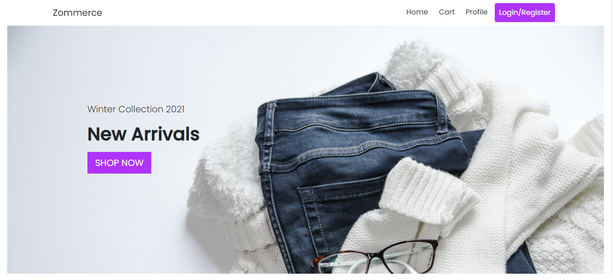
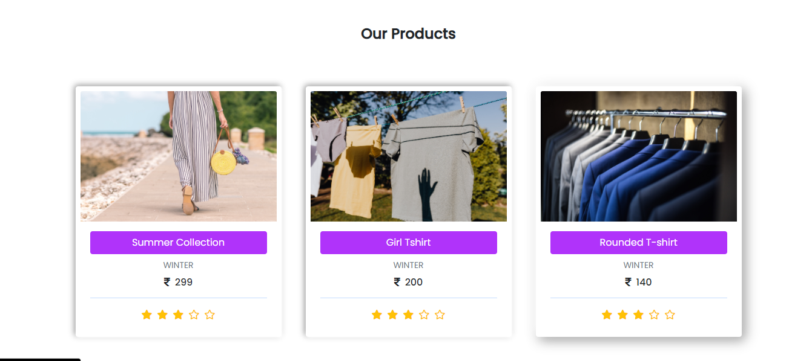
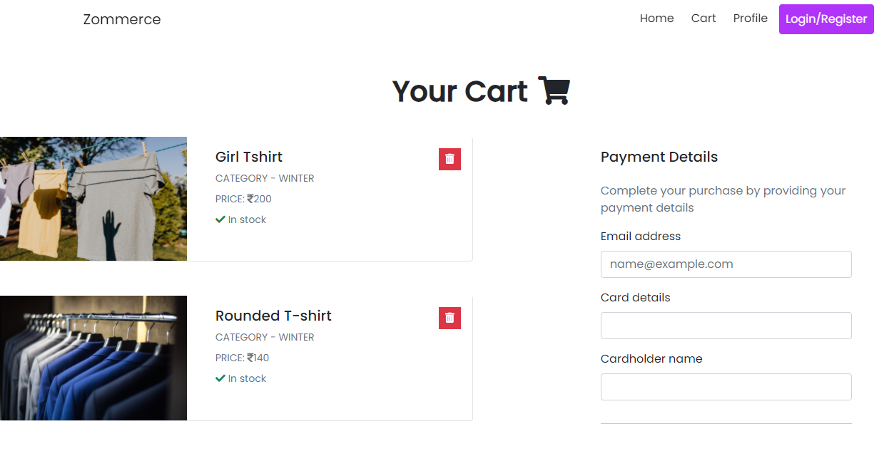

# Zommerce

E-commerce web application built using ReactJS and JSON-Server

#

- To run this project in your local machine:
  - download the files or Clone the repository
    - git clone https://github.com/theakshaymore/zommerce.git
  - in the root of the project directory run “npm install” command
  - after that run the below command
    - “npx json-server --watch Data/db.json --port 8000”
    - this is will start json server in your browser
  - then run “npm start” command

